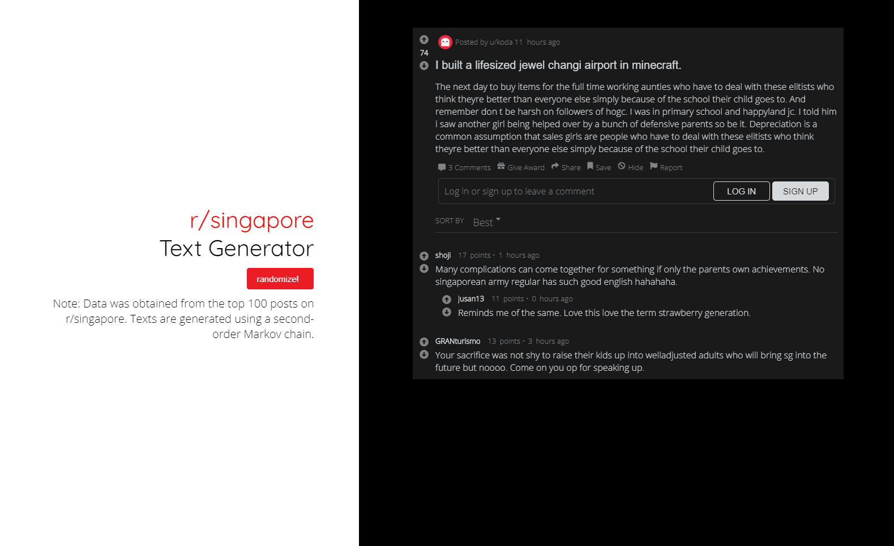
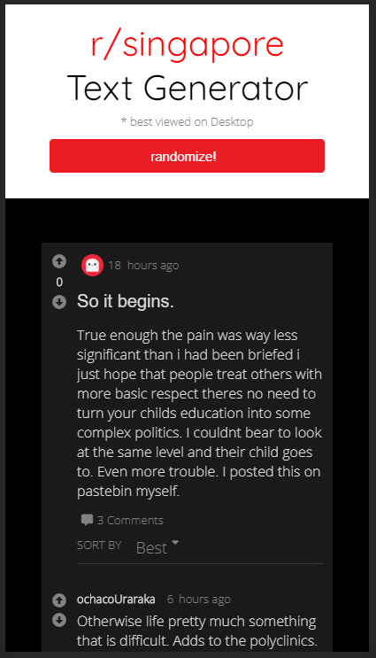

# r/singapore Text Generator

This is a web app that generates Reddit posts on [r/singapore](https://reddit.com/r/singapore/) This is still a work in progress and I am still improving the text generation algorithm! Do let me know if you have any suggestions! The developmental version of the app can be found [here](https://clintonwxy.github.io/reddit-post-generator/)!.

## Description

[r/singapore Text Generator](https://clintonwxy.github.io/reddit-post-generator/) is a web-app that generates pseudo posts found on the Singapore page of Reddit. I had generated these posts from the top 100 all-time posts on the page, and had created text generating algorithms for the title, post, and comments each. Post upvotes, usernames and time are completely random. 

To generate posts, I relied on a second-order Markov Chain, where the probability of a given word in a string of words, is dependent on the previous two words. A dictionary of dictionaries of arrays were used as the data structure, where the prior two words were used as the keys of the nested dictionaries. A random word is then retrieved from the array to be selected as the subsequent word.

This project was inspired by a similar project which I had chanced upon, which generated pseudo posts found on the Straits Times Forum Section. The project's GitHub page can be found [here](https://prestonlimlianjie.github.io/straits-times-forum-letter-generator/).

## Work in Progress
* Increasing size of raw data set used to build the text generation model
* Improving algorithm used to generate text
* Improve data cleaning process, i.e. hyperlinks and tags

## Mobile

I tried to optimise the webpage for mobile. I have little experience with web-dev, but the goal was to have it be readable in mobile view!

## Feedback
Do let me know if you have any feedback or improvements!
